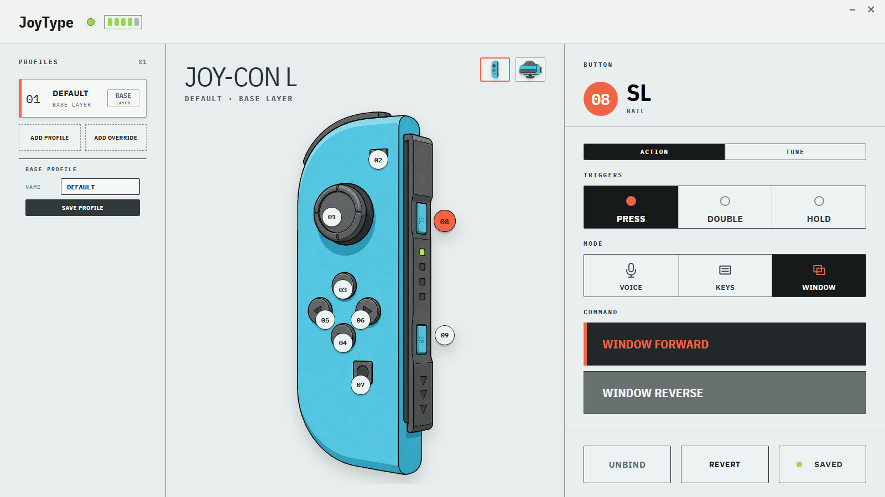

# JoyType

Use a Bluetooth Joy-Con as a compact Windows controller for dictation, coding, and fast desktop actions.



JoyType maps a Joy-Con L to pointer movement, clicks, keyboard shortcuts, window switching, and dictation hotkeys. The configuration UI keeps a clean base profile visible while letting you add per-app overrides, tune button behavior, and adjust the stick pointer without hand-editing YAML.

## Why JoyType

- Drive dictation tools with Joy-Con buttons: hold to talk, or tap to toggle.
- Move the pointer with the analog stick and click by pressing the stick.
- Send common coding/chat actions like Enter, arrows, Escape, and window switching.
- Edit mappings in a visual Joy-Con UI instead of memorizing raw config.
- Use profile layers to keep one clean base profile and add per-app overrides only where they help.
- Tune click feedback, double-tap timing, hold timing, and stick pointer sensitivity from the Config view.

## Download

Download the latest Windows zip from [GitHub Releases](https://github.com/0xDarcyJ/JoyType/releases/latest).
Pair your Joy-Con in Windows Bluetooth settings before launching JoyType. Voice actions trigger configurable hotkeys for your own dictation tool.

## Quick Start

1. Download `JoyType-v*-windows-x64.zip` from the latest release.
2. Extract the zip to a folder such as `C:\JoyType\`.
3. Pair your Joy-Con in Windows Bluetooth settings.
4. Run `JoyType.exe`.
5. Open the Config view to adjust profile layers, button actions, stick pointer feel, Tune settings, and dictation hotkeys.

## Default Controls

| Control | Action |
|---|---|
| Stick | Mouse move |
| L3 / stick press | Left click |
| ZL hold | Push-to-talk hotkey |
| L tap | Toggle dictation hotkey |
| D-pad | Arrow keys |
| MINUS | Enter / send |
| LEFT_SL | Window forward |
| LEFT_SR | Window reverse |

Voice buttons trigger configurable hotkeys for your existing dictation tool. The default voice hotkeys are `LeftShift + LeftCtrl + F8` for push-to-talk and `LeftCtrl + LeftAlt + F8` for toggle dictation.

## Configuration

Packaged builds keep the user-editable config beside the app:

```text
JoyType/
  JoyType.exe
  config.yaml
  _internal/
```

Most settings can be edited from the UI, including profile overrides, actions, Tune settings, and stick pointer behavior. `config.yaml` is still there for advanced edits and backup.

When running from source, JoyType writes ignored `config.local.yaml` from the checked-in `config.default.yaml`, so local settings stay separate from the release default.

## Joy-Con Diagnosis

Run this when Windows says the Joy-Con is paired but JoyType cannot connect:

```cmd
python -m joytype.tools.connection_diag --seconds 8
```

Useful diagnoses:

- `streaming`: Windows HID is healthy and JoyType can read reports.
- `stale_bluetooth_pairing`: Windows remembers the Joy-Con, but the HID game controller node is missing. Remove the Joy-Con in Windows Bluetooth settings, then pair it again.
- `open_failed`: Windows exposes the HID device, but hidapi cannot open it.
- `no_hid_device`: Windows is not exposing a supported Joy-Con HID device.

Joy-Con connections can require removing and re-pairing after the controller has connected to another host. `keep_alive_s` only helps after JoyType is already connected.

## Run From Source

Requirements: Python 3.10+ on Windows.

```cmd
pip install -r requirements.txt
python joytype_gui.py
```

## License

MIT
